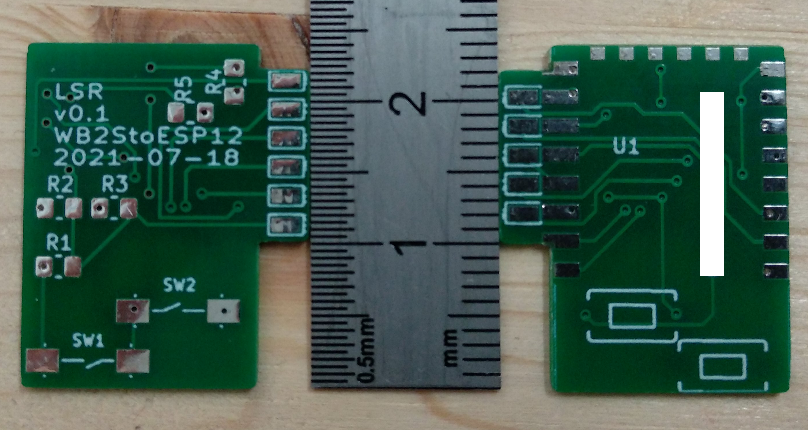

# wb2s-to-esp12
passive pcb adapter-plate (drop-in replacement) for Tuya WB2S Wi-Fi Module to ESP12 Module

## Executive Summary
* This projects provides a drop-in replacement for a "[Tuya WB2S Wi-Fi <i>(sic!)</i> Module](https://developer.tuya.com/en/docs/iot/wb2s-module-datasheet?id=K9ghecl7kc479)". 
* This project consists of a KiCad project that gives you the Gerber files to order a PCB (e.g. at [JLCPCB](https://cart.jlcpcb.com)) onto which one ESP12 (flashed with the firmware of your choice), two switches and five 10k resistors are soldered. Then you remove the WB2S module and solder in your replacement module.  
* For the impatient: Go to [Installation](#Installation). 

## Picture

## Sidenotes
This is my first "public GitHub" project and thus neither very polished nor professional. I made something (crude) that I nevertheless think might be useful for somebody else. That is also the reason why this readme will be very long - for myself I want to document the story behind it for my records, and (hopefully) for your pleasure :-)  
Despite the verbosity of the README, it assumes that you know how to solder and some basic eletronics. Some things here are weirdly specific, while some are infuriating generic (assuming a lot of knowhow). 

## Preamble (Why)
A friend of a friend had WiFi enabled LED lights built into his house, and the electrician wired them to a normal mains switch. Every time he turned them on, 10+ lights got power and tried to connect to the WiFi AP. Some of them didn't get a connection and - default error behavour - started flashing. We (naively) just wanted to reflash [ESPHome](https://esphome.io/) (or [Tasmota](https://tasmota.github.io/docs/)), just to discover after opening the controller/PSU that no ESP but a WB2S module was built in - and those can't be flashed (yet?). Bummer! 

Long story short: We compared the voltages and signal pins - turns out these fit to an ESP! Since the module size reminded me of an ESP12 (and b/c I am a lazy person) I figured I'd just create a passive PCB with similar size as drop-in replacement.

## Pin-mapping
|row #| WB2S (pin)| ESP12 (pin)|
--- | --- | ---
|1|CEN (10)|EN (3)|
|2|AD (8) |ADC (2)|
|3|PWM0 (6) |GPIO4 (19)|
|4|PWM1 (4)|GPIO12 (6)|
|5|PWM2 (2) |GPIO13 (7)|
|6|VBAT (1)|VCC (8)|
|7|GND (3) |GND (15)|
|8|1RX (5) |RXD0 (21)|
|9|1TX (7)|TXD0 (22)|
|10|PWM4 (9)|GPIO5 (20)|
|11|PWM5 (11)|GPIO14 (5)|

## Design Decisions
* Size must not be (much) larger than the WB2S module (so that it fits in the housing of the existing controller/PSU)
* Drop-in replacement, thus all pins must retain the same position
* Utilize as many ESP pins as possible, despite the fact that the controller/PSU did not use all.
* Have a reset button (every IoT device needs one)
* Have a flash button (don't really know why.. but there was space left on the PCB, so why not)
* Because the PCB needed to be as small as possible, the pads for the ESP12 are cut off intentionally. There should be still enough area to get a solderjoint though. 

## BOM (for 1 module)
* 1 x PCB (see [Installation](#Installation)).
* 1 x ESP12 module
* 2 x switches (search for "SMD 3*6 *2.5 MM Tactile Tact Push Button Micro" on AliExpress)
* 5 x 0805 SMD 10k resistors

## Installation
* Get an ESP12 module and flash your preferred firmware and configure your WiFi. I used a device that you can find on AliExpress as "ESP12 burner". I'm writing this as first step b/c IMHO it's easier to flash  before you solder the ESP on the PCB (RX/TX is available, but why make your life compliated...). In the future, just use OTA. 
* Go to [JLCPCB](https://cart.jlcpcb.com/quote) and upload the [gerbers.zip](gerber/gerber.zip). Sidenote: I'm neither sponsored nor do I endorse them specifically, I just find them convenient. <b>Make sure you select the correct PCB thickness (0.8 mm).</b> I also set "Remove Order Number" to "Specify a location" (layout contains a field for this). No other special settings.
* Solder the components. I soldered the ESP12 first (try an reflow oven if you want to be fancy), b/c it provides a nice flat surface to lie on if flipped around for soldering the resistors and switches on the other side. 
* Check continuity of pads to ESP12 contacts with a multimeter (it's no fun to find out that one pad is not OK once the module is soldered in the mainboard).
* Solder the module into the mainboard of the controller/PSU.

## Software
* A friend of mine used this [ESPHome config](ESPhome/esplight.yaml) config.
* [WLED](https://github.com/Aircoookie/WLED) is also very cool. 

## Known 'bugs' (aka things that I plan to change for v0.2)
* The current version v0.1 shows the silkscreen for the courtyard of the switches on the wrong side (that's a IMHO a bug in the component).
* The pads that stick "down through the mainboard" should be shorter (there is no harm if they are shorter, as they are only soldered from the bottom of mainboard anyway) so that they are not that close to the ESP12 pads.
* Try to name the pads with silkscreen (3v3, GND, GPIOx, ...)
* Name the switches with silkscreen (SW1=RST and SW2=FLSH)

## License and Legalese
* May be (re)used for personal/private use only and not sold/licensed for commercial or financial gain. This non-standard license should make it impossible and really difficult for commercial enterprises to profit from my work (pay people to design this!), but enable the hobbyist/enthusiast to work with it. 
* I am using parts of the "SparkFun Electronics KiCad Libraries" which is licensed under the [Creative Commons Attribution 4.0 International](https://creativecommons.org/licenses/by/4.0/) license. 
* If I have inadverently (re-)used your work with either properly attributing it or something, please let me know - I'd be happy to correct this.

## Donations
Yes please.

## Feedback
Also yes please! (I hope I figure out how this whole pull-request thing works...)

## Shoutout ...
* ... to [CCC](https://www.ccc.de) and [CCCZH](https://www.ccczh.ch/)!
* ... to all FOSS contributors that helped making SW that enabled me to do this. Nanos gigantium humeris insidentes.
